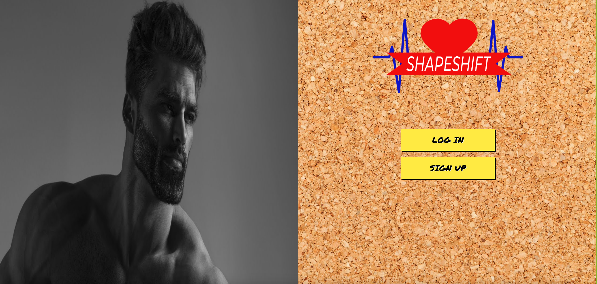

  

# SHAPESHIFT

# Getting Started

  

Click [here]([https://shapeshift-peds.netlify.app/](https://shapeshift-peds.netlify.app/)) link to go to the app!

Click [here](https://trello.com/b/FlVCz559/shapeshift) to check out the Trello!

Click [here](https://github.com/PeterLucido/SHAPESHIFT-back-end) to check out the backend repo!

# Contributors

[Peter Lucido](https://github.com/PeterLucido)

[Eugene Fung](https://github.com/efung7994)

[Dawson Myers](https://github.com/dawson120)

[Stephen Im](https://github.com/stevim)

# Background
ShapeShift is a user-friendly app designed to simplify the management of your overall well-being by tracking sleep, food intake, and exercise. With its easy-to-use interface and advanced technology, ShapeShift provides you with personalized data on your health and wellness. Discover a healthier, more balanced lifestyle by monitoring your progress with ShapeShift as your ultimate health companion.

  

# Technologies Used

  

- Node.js

- Express

- MongoDB

- Mongoose

- Javascript

- React

- CSS

- Git

- Fly.io

- Netlify

- Cloudinary
- Postman

  

# Attributions

[Landing Page Stock Photos](https://www.pexels.com/)

[Other Stock Photos](https://elements.envato.com/)

[Login Button Styling](https://codepen.io/seaox/pen/GRRbzjY)

[Inspirational Quotes API](https://forum.freecodecamp.org/t/free-api-inspirational-quotes-json-with-code-examples/311373)

  

# Next Steps

- [x] Show a different motivational quote every time a user navigates to or refreshes the page
- [x] Render a user's profile photo in the navigation bar

- [ ] See an empty card for any missed days 

- [ ] Functionality to search for foods in a search bar instead of having a user input their meals

- [ ] Mobile-friendly view

- [ ] Add function to track calories automatically when food is input into the meals category